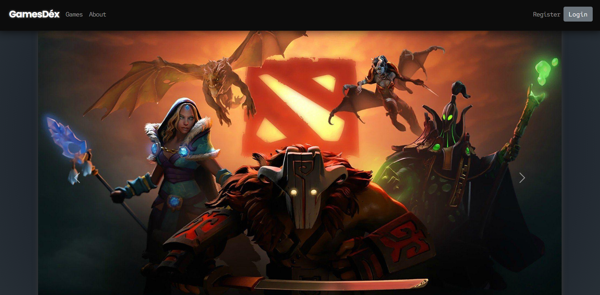

# GamesDex - An ICT 1004 Project

## Who we are
We are a team of students from *Singapore Institute of Technology* currently studying **ICT1004 (Web Systems and Techonologies)**. We hope that through this project, we would be able to apply what we have learnt in class and improve our Web Development skills.

For our project, we decided to do a gaming ecommerce site as we were all passionate about video games.

The main technologies we used were:

- **HTML** -> HTML templating
- **CSS** -> Styling
- **Bootstrap** -> CSS library to accelarate styling process
- **Vanilla JS** -> Client-side scripting
- **PHP** -> Main Server-side technology
- **Google Cloud** -> Cloud hosting service
- **Apache** -> Web server software
- **MySQL** -> Database management system (DBMS)

View our website [here](http://34.126.181.163/project/index.php)!

